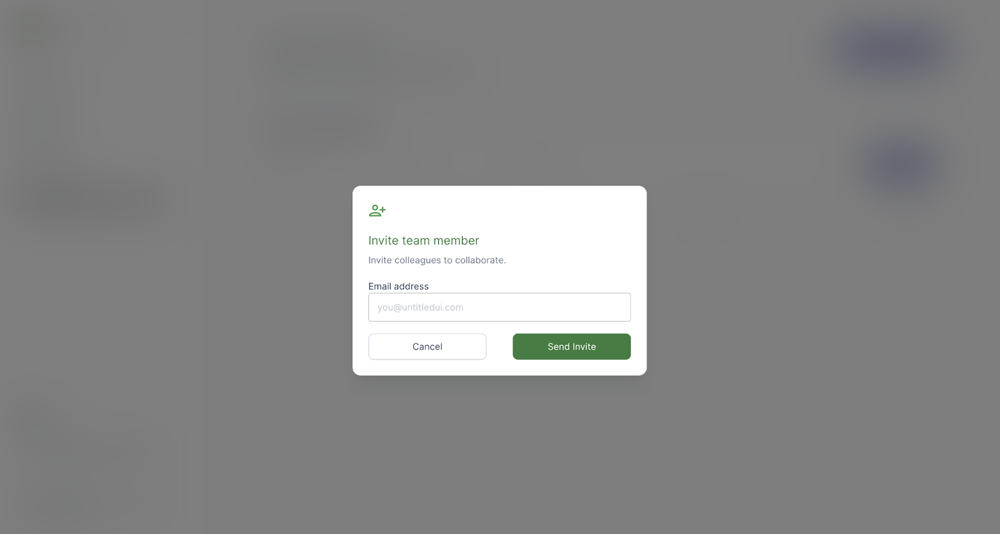

# Adding New Team Members

## Inviting team members

Adding new members to your team is easy.

1. Go to the Teams section of your dashboard.

<figure><figcaption></figcaption></figure>

2. Click the Add User button&#x20;

<figure><figcaption></figcaption></figure>

3. Add the email address of the user you want to invite.&#x20;
4. Click `Send Invite`

An invite with instructions will automatically be sent to your team member! You will also see their email listed on your Teams page.

### Accepting invites

When invited by a teammate, you will receive an email with a link to join your team's GuardianUI Workspace. This link contains a unique, single-use token that allows you to join the team.
